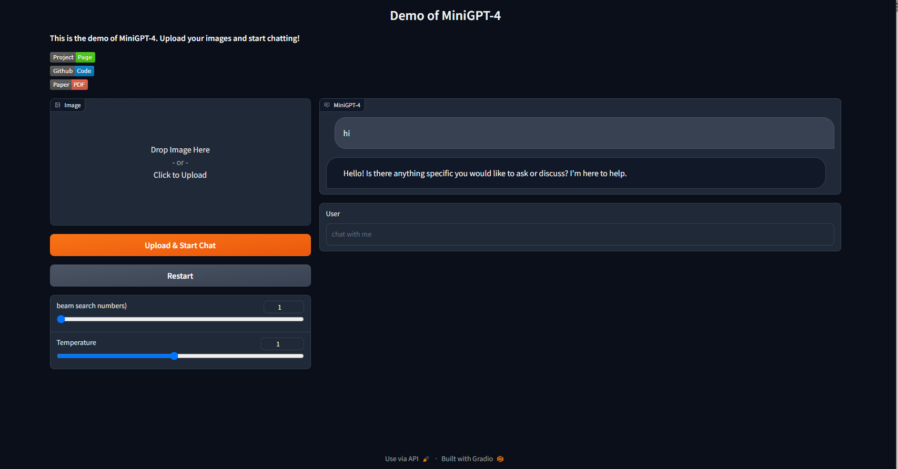

## miniGPT4 <p>🚀🚀</p>
本项目修改了demo.py和conversation.py，能够支持直接文本对话，而无需先上传图片。

**TODO: 支持多图上传回答**

演示：


以下是项目的环境配置过程，如果你已经配好了，跳过环境配置的阶段，直接运行demo.py即可

[官方](https://github.com/Vision-CAIR/MiniGPT-4)
提供参数量为[13B](https://drive.google.com/file/d/1a4zLvaiDBr-36pasffmgpvH5P7CKmpze/view)和[7B](https://drive.google.com/file/d/1a4zLvaiDBr-36pasffmgpvH5P7CKmpze/view)的checkpoint可供微调 

**所需配置** 

官方使用A100显卡
* 13B： 23G显存
* 7B: 11.5G显存

### 步骤
**0.环境准备**

拉取已有docker[镜像](https://hub.docker.com/r/bewithmeallmylife/mini-gpt4-runtime-cuda-10.2)
```commandline
docker pull bewithmeallmylife/mini-gpt4-runtime-cuda-10.2:1.0.0
```
构建容器, 暴露对应端口，以便启动前端ui在本地使用
```commandline
docker run -v /data:/projects -v /data2:/data2 -p 1118:7778 --shm-size 8G --name minigpt4 -d bewithmeallmylife/mini-gpt4-runtime-cuda-10.2:1.0.0 tail -f /dev/null
```
进入容器
```commandline
docker exec -it minigpt4 bash
```
启动conda虚拟环境**mini-gpt4**
```commandline
conda activate mini-gpt4
```
该镜像中miniGPT4所需的推理环境已有，pytorch版本为1.12.1+cu10.2，并不支持sm86的算力，如果显卡型号为RTX A6000，算力为8.6，需重新安装支持该算力的版本如torch1.12.1+cu11.3 
```commandline
conda install pytorch==1.12.1 torchvision==0.13.1 torchaudio==0.12.1 cudatoolkit=11.3 -c pytorch
```

**1.准备预训练的模型权重**

一共需要准备3个预训练的模型权重 vicuna（7B/14G），llama（7B/12.5G），和miniGPT4（7B）
* vicuna
可下载13B和7B两种大小的预训练权重
```commandline
git lfs install
git clone https://huggingface.co/lmsys/vicuna-13b-delta-v0  # more powerful, need at least 24G gpu memory
# or
git clone https://huggingface.co/lmsys/vicuna-7b-delta-v0  # smaller, need 12G gpu memory
```
这两个权重还并非可用的，需搭配llama权重激活使用
* 下载llama权重如下，官方并未开放下载，采用第三方下载形式, 选择7B或13B
```commandline
wget https://agi.gpt4.org/llama/LLaMA/tokenizer.model -O ./tokenizer.model
wget https://agi.gpt4.org/llama/LLaMA/tokenizer_checklist.chk -O ./tokenizer_checklist.chk
wget https://agi.gpt4.org/llama/LLaMA/7B/consolidated.00.pth -O ./7B/consolidated.00.pth
wget https://agi.gpt4.org/llama/LLaMA/7B/params.json -O ./7B/params.json
wget https://agi.gpt4.org/llama/LLaMA/7B/checklist.chk -O ./7B/checklist.chk
wget https://agi.gpt4.org/llama/LLaMA/13B/consolidated.00.pth -O ./13B/consolidated.00.pth
wget https://agi.gpt4.org/llama/LLaMA/13B/consolidated.01.pth -O ./13B/consolidated.01.pth
wget https://agi.gpt4.org/llama/LLaMA/13B/params.json -O ./13B/params.json
wget https://agi.gpt4.org/llama/LLaMA/13B/checklist.chk -O ./13B/checklist.chk
```
下载完llama权重之后，还需要转换成huggingface的模型格式
```commandline
git clone https://github.com/huggingface/transformers.git
python transformers/src/transformers/models/llama/convert_llama_weights_to_hf.py \
    --input_dir /path/to/downloaded/llama/weights --model_size 7B --output_dir /output/path/to/llama-13bOR7b-hf/
```
当vicuna和llama两个权重都准备好了之后，还需要将它们组合在一起得到能够使用得vicuna权重
```commandline
pip install git+https://github.com/lm-sys/FastChat.git@v0.1.10
python -m fastchat.model.apply_delta --base /path/to/llama-13bOR7b-hf/  --target /path/to/save/working/vicuna/weight/  --delta /path/to/vicuna-13bOR7b-delta-v0/
```
最终获得一个可以使用的权重，它的文件格式如下：
```commandline
vicuna_weights
├── config.json
├── generation_config.json
├── pytorch_model.bin.index.json
├── pytorch_model-00001-of-00003.bin
...   
```
将该权重文件的路径添加到配置文件minigpt4/configs/models/minigpt4.yaml的第16行
* minigpt4预训练权重下载

[13B的checkpoint](https://drive.google.com/file/d/1a4zLvaiDBr-36pasffmgpvH5P7CKmpze/view?usp=share_link)
[7B的checkpoint](https://drive.google.com/file/d/1RY9jV0dyqLX-o38LrumkKRh6Jtaop58R/view?usp=sharing)

将下好的权重路径加到配置文件eval_configs/minigpt4_eval.yaml的第11行

**2.运行demo.py**
```commandline
python demo.py --cfg-path eval_configs/minigpt4_eval.yaml  --gpu-id 0
```
